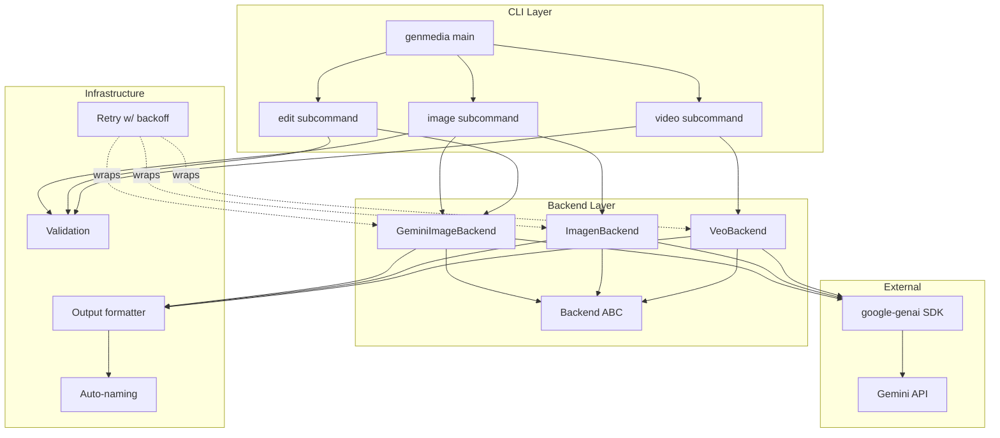
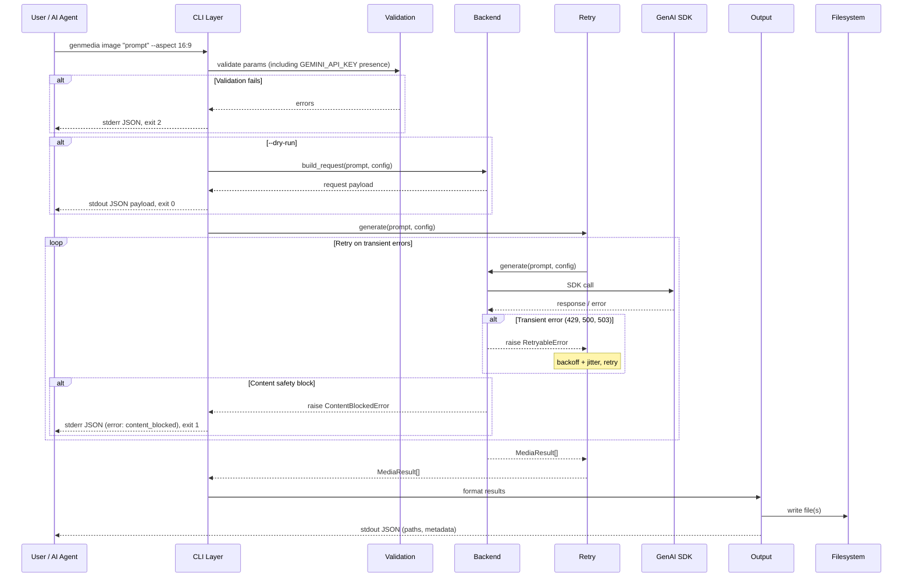
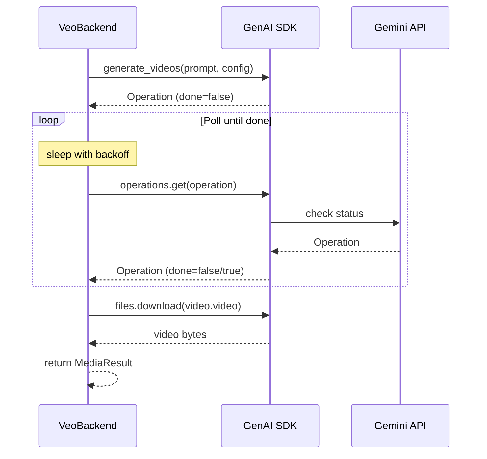
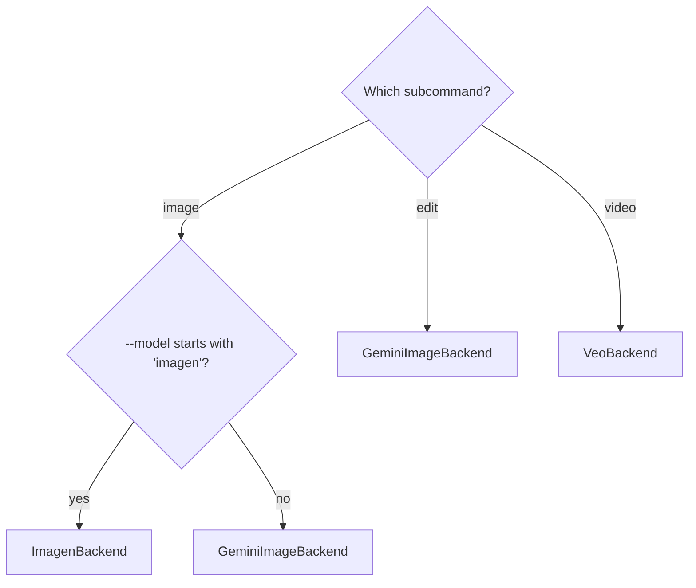

# GenMedia CLI — Design Spec

## Overview

A multimodal media generation CLI built on the Google GenAI Python SDK. Subcommand-based architecture covering image generation (Gemini native + Imagen), image editing, and video generation (Veo).

**AI-first design**: JSON output by default. The primary consumers are AI agents that parse structured responses, read file paths, and branch on exit codes. The `--pretty` flag switches to human-friendly output for cases where an agent needs to present results to a user, or when a human is driving directly.

**Why `/tmp/genmedia/` as default output**: AI callers don't care where files land — they read the path from the JSON response. Defaulting to a temp directory avoids cluttering the user's working directory. Files persist until reboot. `--output` and `--output-dir` override this for any caller that wants explicit control.

## Architecture

### Component Diagram



### Data Flow



### Veo Polling Flow



**Ctrl+C during polling**: Catches `KeyboardInterrupt`, outputs a JSON error to stderr with `"error": "cancelled"`, and exits with code 1. The server-side operation cannot be cancelled via the SDK — it continues running. This is a known limitation; the error message should note it: `"message": "Polling cancelled. The server-side operation may still be running."`.

## Object Model


## CLI Interface

### Command Structure

```
genmedia <subcommand> [args] [flags]

Subcommands:
  image    Generate images (Gemini native or Imagen)
  edit     Edit/inpaint an existing image
  video    Generate video (Veo)
```

### Shared Flags

| Flag | Short | Default | Description |
|------|-------|---------|-------------|
| `--model` | `-m` | per-subcommand | Model ID |
| `--output` | `-o` | auto-named in /tmp/genmedia/ | Output file path |
| `--output-dir` | `-d` | /tmp/genmedia/ | Output directory for batch |
| `--count` | `-n` | 1 | Number of outputs to generate |
| `--aspect` | `-a` | None (model default) | Aspect ratio |
| `--verbose` | `-v` | false | Include extra metadata: raw SDK response shape, retry details, timing breakdown per attempt |
| `--pretty` | | false | Human-friendly output instead of JSON |
| `--dry-run` | | false | Validate + show request payload, don't call API |

### `image` Subcommand

```
genmedia image <prompt> [flags]
```

| Flag | Short | Default | Description |
|------|-------|---------|-------------|
| `--size` | `-s` | None | Image size: `512`, `1K`, `2K`, `4K` |
| `--format` | `-f` | png | Output format: png, jpg, webp |
| `--list-models` | | | List available image generation models |

Default model: `gemini-3.1-flash-image-preview`

Backend selection: if `--model` starts with `imagen`, use ImagenBackend. Otherwise GeminiImageBackend.

**`--count` behavior by backend:**
- **GeminiImageBackend**: Makes N separate `generate_content()` calls sequentially. The API does not support batch in a single call.
- **ImagenBackend**: Uses `number_of_images` in `GenerateImagesConfig` — the API handles count natively in a single call.

### `edit` Subcommand

```
genmedia edit <input_image> <prompt> [flags]
```

| Flag | Short | Default | Description |
|------|-------|---------|-------------|
| `--format` | `-f` | png | Output format: png, jpg, webp |
| `--aspect` | `-a` | None (preserves input dimensions) | Override output aspect ratio |
| `--size` | `-s` | None | Override output size |
| `--count` | `-n` | 1 | Number of variations to generate |

Default model: `gemini-3.1-flash-image-preview`

Always uses GeminiImageBackend. The CLI layer reads the input image file, packages it as a `types.Part.from_bytes(data=image_bytes, mime_type=detected_mime)` content part alongside the text prompt, and passes both to the backend.

**SDK call shape for editing:**

```python
response = client.models.generate_content(
    model="gemini-3.1-flash-image-preview",
    contents=[
        "Edit this image: remove the background",
        types.Part.from_bytes(data=image_bytes, mime_type="image/png"),
    ],
    config=types.GenerateContentConfig(
        response_modalities=["TEXT", "IMAGE"],
        image_config=types.ImageConfig(
            aspect_ratio="16:9",   # optional, omit to preserve input dimensions
            image_size="2K",       # optional
        ),
    ),
)
```

Note: `response_modalities` is `["TEXT", "IMAGE"]` for editing (not just `["IMAGE"]`). The response may contain both text and image parts — the backend extracts only the image parts.

`--aspect` and `--count` work but are optional — omitting them preserves the input image's dimensions. `--count` makes N separate API calls (same as `image` with Gemini).

### `video` Subcommand

```
genmedia video <prompt> [flags]
```

| Flag | Short | Default | Description |
|------|-------|---------|-------------|
| `--duration` | | 8 | Duration in seconds: 4, 6, or 8 |
| `--list-models` | | | List available video generation models |

Default model: `veo-3.0-generate-001`

Always uses VeoBackend. Long-running operation with polling.

Output is always MP4 (`video/mp4`). No `--format` flag — the API does not support other containers.

## Output Contract

### Success (stdout, JSON)

```json
{
  "status": "success",
  "files": [
    {
      "path": "/tmp/genmedia/genmedia_001.png",
      "mime_type": "image/png",
      "size_bytes": 2451832
    }
  ],
  "model": "gemini-3.1-flash-image-preview",
  "elapsed_seconds": 4.2,
  "request": {
    "prompt": "a cat on a skateboard",
    "aspect_ratio": "16:9",
    "image_size": "4K"
  }
}
```

Video entries also include `"duration_seconds"`. Batch (`--count N`) produces multiple entries in `files`.

### Error (stderr, JSON)

```json
{
  "status": "error",
  "error": "rate_limited",
  "message": "429 Too Many Requests after 5 retries",
  "retries_attempted": 5,
  "elapsed_seconds": 47.3
}
```

### Error Categories

| `error` value | Meaning | Exit Code |
|---------------|---------|-----------|
| `rate_limited` | 429 after exhausting retries | 1 |
| `server_error` | 500/503 after exhausting retries | 1 |
| `content_blocked` | Prompt or response blocked by safety filters | 1 |
| `cancelled` | User interrupted (Ctrl+C) during operation | 1 |
| `api_error` | Other API errors (auth, quota, unknown) | 1 |
| `validation_error` | Bad params, missing prompt, missing API key | 2 |
| `file_error` | Can't read input / can't write output | 3 |

### Content Safety Block Details

The GenAI SDK does not raise exceptions for safety blocks. Instead:

- **Prompt-level block**: `response.prompt_feedback.block_reason` is set (values: `SAFETY`, `IMAGE_SAFETY`, `JAILBREAK`, `BLOCKLIST`, `PROHIBITED_CONTENT`). When blocked at the prompt level, `candidates` is empty.
- **Response-level block**: `response.candidates[0].finish_reason == "SAFETY"`. The candidate exists but content is withheld.

Both cases produce a `content_blocked` error with the block reason in the message:

```json
{
  "status": "error",
  "error": "content_blocked",
  "message": "Prompt blocked by safety filter: IMAGE_SAFETY",
  "block_reason": "IMAGE_SAFETY"
}
```

### Exit Codes

| Code | Meaning |
|------|---------|
| 0 | Success |
| 1 | API error (rate limit, server error, content blocked, cancelled) |
| 2 | Validation error (bad params, missing prompt, missing API key, empty prompt) |
| 3 | File I/O error (can't write output, can't read input image, disk full) |

### Missing `GEMINI_API_KEY`

If `GEMINI_API_KEY` is not set, this is a validation error (exit 2):

```json
{
  "status": "error",
  "error": "validation_error",
  "message": "GEMINI_API_KEY environment variable is not set"
}
```

Checked before any API call, even before parameter validation.

### Empty / Whitespace-Only Prompts

`genmedia image ""` or `genmedia image "   "` is a validation error (exit 2):

```json
{
  "status": "error",
  "error": "validation_error",
  "message": "Prompt cannot be empty"
}
```

### `--pretty` Mode

Replaces JSON with human-friendly output:
- Spinner during generation / polling
- Progress line per retry attempt
- "Saved to /path/file.png" on success
- Colorized error messages
- No JSON at all

### `--dry-run` Output

```json
{
  "status": "dry_run",
  "backend": "GeminiImageBackend",
  "sdk_method": "client.models.generate_content",
  "model": "gemini-3.1-flash-image-preview",
  "config": {
    "response_modalities": ["IMAGE"],
    "image_config": {
      "aspect_ratio": "16:9",
      "image_size": "4K"
    }
  },
  "validation_errors": []
}
```

If validation errors exist, they populate `validation_errors` and exit code is still 0 (dry-run succeeded in its purpose — showing you what's wrong).

### `--list-models` Output

Hardcoded model list (not fetched from API — doesn't require an API key). Output format:

**JSON mode (default):**

```json
{
  "models": [
    {
      "id": "gemini-3.1-flash-image-preview",
      "default": true,
      "notes": "Best quality, recommended"
    },
    {
      "id": "gemini-3-pro-image-preview",
      "default": false,
      "notes": "Previous generation"
    }
  ]
}
```

**`--pretty` mode:**

```
Available image generation models:

  gemini-3.1-flash-image-preview  (default)  Best quality, recommended
  gemini-3-pro-image-preview                  Previous generation
  gemini-2.5-flash-image                      Older, faster
  imagen-4.0-generate-001                     Imagen — different API endpoint
```

`edit` does not have `--list-models` since it uses the same models as `image`. This is documented in `--help` for the `edit` subcommand.

## Retry Logic

**Retryable errors:** 429, 500, 503, network timeouts.
**Not retryable:** 400, 403, content safety blocks.

**Strategy:** Exponential backoff with jitter.
- Base delay: 2s
- Multiplier: 2x
- Max delay cap: 60s
- Default max retries: 5
- Respects `Retry-After` header when present

**Escape-hatch env vars (documented, not promoted):**
- `GENMEDIA_MAX_RETRIES` — override max retries
- `GENMEDIA_RETRY_BASE_DELAY` — override base delay in seconds

In JSON mode, retries are silent — `retries_attempted` appears in the output.
In `--pretty` mode, each retry prints: `Retry 2/5 in 4.3s (rate limited)...`

## Auto-Naming

When no `--output` is given:
- Files go to `/tmp/genmedia/` (created on first use)
- Named `genmedia_001.png`, `genmedia_002.png`, etc.
- Extension matches output format (`.png`, `.jpg`, `.webp`, `.mp4`)
- Collision avoidance: scan existing files, increment counter
- `--output-dir` overrides the directory, keeps the auto-naming scheme

**Partial write cleanup**: If generating multiple files (`--count N`) and a write fails partway through (e.g., disk full), successfully written files are kept and included in the error response. The error JSON includes both a `files` array (what was written) and the error details. This lets the caller salvage partial results.

## Backend Selection



## Validation Rules

Validated locally before any API call:

| Parameter | Valid Values | Applies To | Notes |
|-----------|-------------|------------|-------|
| `GEMINI_API_KEY` | must be set | all | Checked first |
| `prompt` | non-empty, non-whitespace | all | |
| `aspect_ratio` | `1:1`, `1:4`, `1:8`, `2:3`, `3:2`, `3:4`, `4:1`, `4:3`, `4:5`, `5:4`, `8:1`, `9:16`, `16:9`, `21:9` | image, edit, video | Video only supports `16:9`, `9:16` |
| `image_size` | `512`, `1K`, `2K`, `4K` | image, edit (Gemini only, not Imagen) | Case-insensitive input, normalized to uppercase internally |
| `output_format` | `png`, `jpg`, `webp` | image, edit | Video is always mp4 |
| `duration_seconds` | `4`, `6`, `8` | video | |
| `count` | 1+ integer | image, edit, video | |
| `model` | must be in known models list | all | Unknown model → warning, not error |
| `input_image` | file must exist, must be image mime type | edit | |

## Project Structure

```
genmedia/
├── pyproject.toml
├── src/
│   └── genmedia/
│       ├── __init__.py
│       ├── cli/
│       │   ├── __init__.py
│       │   ├── main.py          # Click group, shared options
│       │   ├── image.py         # image subcommand
│       │   ├── edit.py          # edit subcommand
│       │   └── video.py         # video subcommand
│       ├── backends/
│       │   ├── __init__.py
│       │   ├── base.py          # Backend ABC, MediaResult, MediaConfig
│       │   ├── gemini.py        # GeminiImageBackend
│       │   ├── imagen.py        # ImagenBackend
│       │   └── veo.py           # VeoBackend
│       ├── output.py            # JSON + pretty formatting
│       ├── retry.py             # Exponential backoff with jitter
│       └── validation.py        # Parameter validation
├── tests/
│   ├── unit/
│   │   ├── test_cli.py
│   │   ├── test_backends.py
│   │   ├── test_output.py
│   │   ├── test_retry.py
│   │   ├── test_validation.py
│   │   └── test_naming.py
│   └── integration/
│       ├── test_gemini_image.py
│       ├── test_imagen.py
│       ├── test_veo.py
│       └── conftest.py          # GENMEDIA_TEST_LIVE gate
└── docs/
    └── superpowers/
        └── specs/
            └── 2026-03-23-genmedia-cli-design.md
```

Uses `src/` layout with `pyproject.toml` for modern Python packaging. Installable via `pip install .` or `pipx install .`.

## Dependencies

| Package | Purpose |
|---------|---------|
| `google-genai` | Google GenAI SDK |
| `click` | CLI framework |
| `pytest` | Test framework (dev) |
| `pytest-mock` | Mocking convenience (dev) |

No other runtime dependencies. Keep it lean.

## Available Models (as of March 2026)

### Image Generation

| Model ID | Default For | Notes |
|----------|-------------|-------|
| `gemini-2.5-flash-image` | — | Older, faster |
| `gemini-3-pro-image-preview` | — | What nanobanana-cli hardcodes |
| `gemini-3.1-flash-image-preview` | `image`, `edit` | Best quality |
| `imagen-4.0-generate-001` | — | Imagen, different endpoint |

### Video Generation

| Model ID | Default For | Notes |
|----------|-------------|-------|
| `veo-3.0-generate-001` | `video` | Standard quality |
| `veo-3.0-fast-generate-001` | — | Faster, lower quality |
| `veo-3.1-generate-preview` | — | Newer preview |
| `veo-3.1-fast-generate-preview` | — | Newer fast preview |

## Testing Strategy

### Unit Tests (always run, mocked)

Mock at the backend boundary — not deep inside the SDK. Unit tests provide fake backends that return canned `MediaResult` objects or raise specific exceptions.

- **CLI parsing**: correct flags resolve to correct backend + config
- **Validation**: bad aspect ratios, invalid models, missing prompts, missing API key → proper errors
- **Backend request building**: given params, assert the SDK call shape is correct
- **Output formatting**: given a `MediaResult`, assert JSON structure and `--pretty` output
- **Retry logic**: mock a backend that returns 429 N times then succeeds, assert retry count and backoff timing
- **Auto-naming**: collision avoidance in `/tmp/genmedia/`
- **Dry-run**: assert it outputs the request payload without calling the backend
- **Error contract**: assert exit codes, stderr JSON shape
- **Content safety**: mock responses with `block_reason` and `finish_reason=SAFETY`, assert correct error output
- **Partial write**: mock disk-full after N writes, assert partial results in error response

### Integration Tests (gated behind `GENMEDIA_TEST_LIVE=1`)

- One happy-path per backend: Gemini image, Imagen image, Veo video
- One edit test (Gemini with input image)
- Each test: fire real API call, assert we get bytes back, assert output file exists
- Slow and costs tokens — run manually or in CI with secrets

### Test Framework

pytest with `unittest.mock` / `pytest-mock`. No exotic dependencies.
