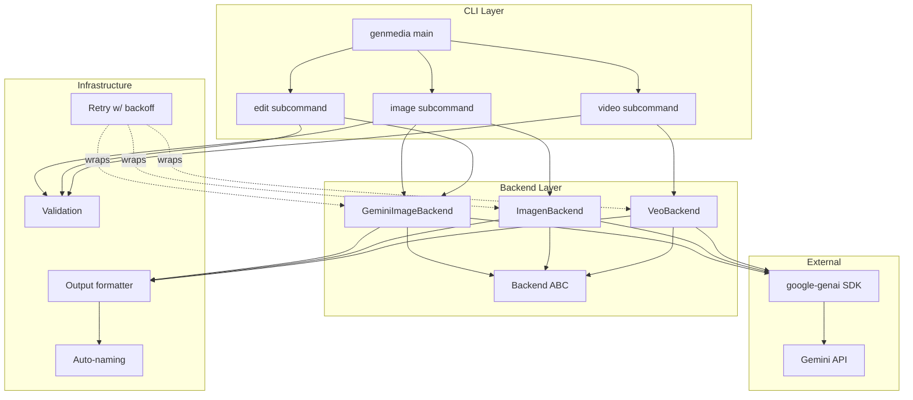
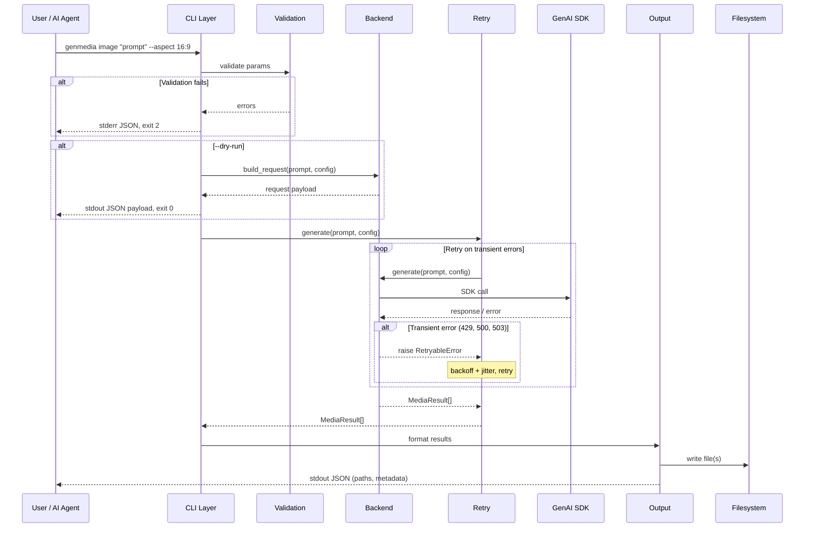
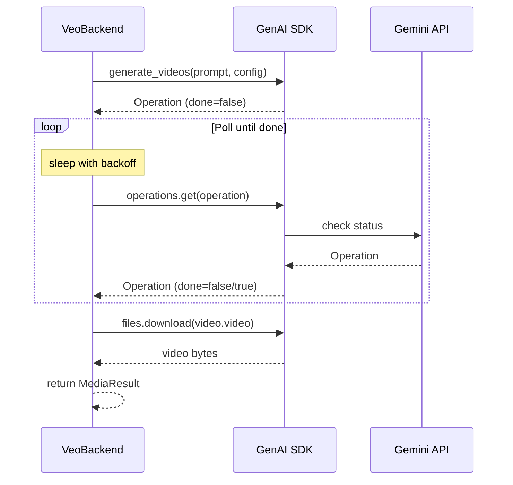
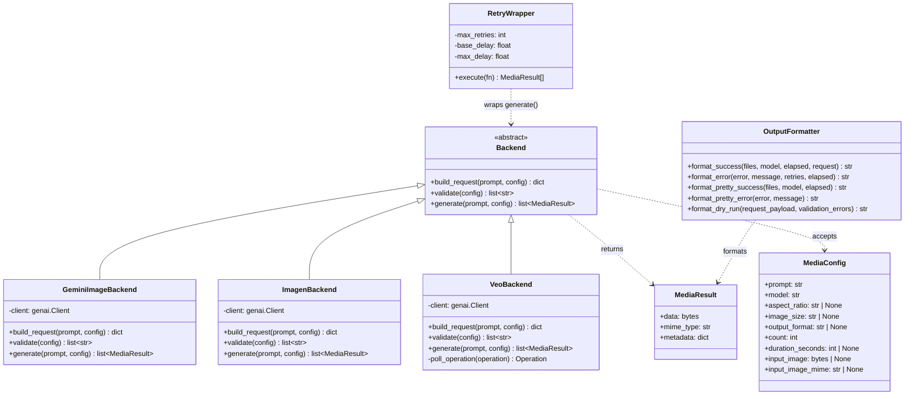
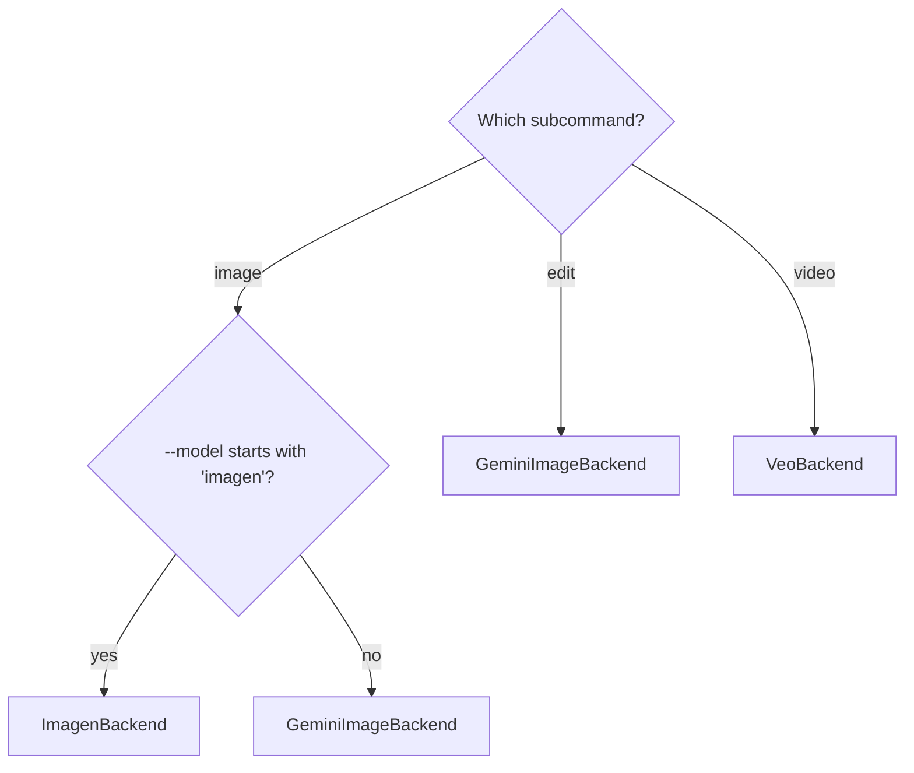

# GenMedia CLI — Design Spec

## Overview

A multimodal media generation CLI built on the Google GenAI Python SDK. Subcommand-based architecture covering image generation (Gemini native + Imagen), image editing, and video generation (Veo). JSON output by default for AI consumers; `--pretty` flag for humans.

## Architecture

### Component Diagram



### Data Flow



### Veo Polling Flow



## Object Model



## CLI Interface

### Command Structure

```
genmedia <subcommand> [args] [flags]

Subcommands:
  image    Generate images (Gemini native or Imagen)
  edit     Edit/inpaint an existing image
  video    Generate video (Veo)
```

### Shared Flags

| Flag | Short | Default | Description |
|------|-------|---------|-------------|
| `--model` | `-m` | per-subcommand | Model ID |
| `--output` | `-o` | auto-named in /tmp/genmedia/ | Output file path |
| `--output-dir` | `-d` | /tmp/genmedia/ | Output directory for batch |
| `--count` | `-n` | 1 | Number of outputs to generate |
| `--aspect` | `-a` | None (model default) | Aspect ratio |
| `--verbose` | `-v` | false | Show request details, timing in metadata |
| `--pretty` | | false | Human-friendly output instead of JSON |
| `--dry-run` | | false | Validate + show request payload, don't call API |
| `--json` | | true (no-op) | Explicit JSON mode, courtesy flag for AI callers |

### `image` Subcommand

```
genmedia image <prompt> [flags]
```

| Flag | Short | Default | Description |
|------|-------|---------|-------------|
| `--size` | `-s` | None | Image size (e.g. `4K`) |
| `--format` | `-f` | png | Output format: png, jpg, webp |
| `--list-models` | | | List available image generation models |

Default model: `gemini-3.1-flash-image-preview`

Backend selection: if `--model` starts with `imagen`, use ImagenBackend. Otherwise GeminiImageBackend.

### `edit` Subcommand

```
genmedia edit <input_image> <prompt> [flags]
```

| Flag | Short | Default | Description |
|------|-------|---------|-------------|
| `--format` | `-f` | png | Output format: png, jpg, webp |

Default model: `gemini-3.1-flash-image-preview`

Always uses GeminiImageBackend. The CLI layer reads the input image, packages it as a content part alongside the prompt, and hands both to the backend. The backend doesn't distinguish between generate and edit.

### `video` Subcommand

```
genmedia video <prompt> [flags]
```

| Flag | Short | Default | Description |
|------|-------|---------|-------------|
| `--duration` | | 5 | Duration in seconds |
| `--list-models` | | | List available video generation models |

Default model: `veo-3.0-generate-001`

Always uses VeoBackend. Long-running operation with polling.

## Output Contract

### Success (stdout, JSON)

```json
{
  "status": "success",
  "files": [
    {
      "path": "/tmp/genmedia/genmedia_001.png",
      "mime_type": "image/png",
      "size_bytes": 2451832
    }
  ],
  "model": "gemini-3.1-flash-image-preview",
  "elapsed_seconds": 4.2,
  "request": {
    "prompt": "a cat on a skateboard",
    "aspect_ratio": "16:9",
    "image_size": "4K"
  }
}
```

Video entries also include `"duration_seconds"`. Batch (`--count N`) produces multiple entries in `files`.

### Error (stderr, JSON)

```json
{
  "status": "error",
  "error": "rate_limited",
  "message": "429 Too Many Requests after 5 retries",
  "retries_attempted": 5,
  "elapsed_seconds": 47.3
}
```

### Exit Codes

| Code | Meaning |
|------|---------|
| 0 | Success |
| 1 | API error (rate limit, server error, content blocked) |
| 2 | Validation error (bad params, missing prompt, unsupported aspect ratio) |
| 3 | File I/O error (can't write output, can't read input image) |

### `--pretty` Mode

Replaces JSON with human-friendly output:
- Spinner during generation
- Progress line per retry attempt
- "Saved to /path/file.png" on success
- Colorized error messages
- No JSON at all

### `--dry-run` Output

```json
{
  "status": "dry_run",
  "backend": "GeminiImageBackend",
  "sdk_method": "client.models.generate_content",
  "model": "gemini-3.1-flash-image-preview",
  "config": {
    "response_modalities": ["IMAGE"],
    "image_config": {
      "aspect_ratio": "16:9",
      "image_size": "4K"
    }
  },
  "validation_errors": []
}
```

If validation errors exist, they populate `validation_errors` and exit code is still 0 (dry-run succeeded in its purpose — showing you what's wrong).

## Retry Logic

**Retryable errors:** 429, 500, 503, network timeouts.
**Not retryable:** 400, 403, content safety blocks.

**Strategy:** Exponential backoff with jitter.
- Base delay: 2s
- Multiplier: 2x
- Max delay cap: 60s
- Default max retries: 5
- Respects `Retry-After` header when present

**Escape-hatch env vars (documented, not promoted):**
- `GENMEDIA_MAX_RETRIES` — override max retries
- `GENMEDIA_RETRY_BASE_DELAY` — override base delay in seconds

In JSON mode, retries are silent — `retries_attempted` appears in the output.
In `--pretty` mode, each retry prints: `Retry 2/5 in 4.3s (rate limited)...`

## Auto-Naming

When no `--output` is given:
- Files go to `/tmp/genmedia/`
- Named `genmedia_001.png`, `genmedia_002.png`, etc.
- Extension matches output format (`.png`, `.jpg`, `.webp`, `.mp4`)
- Collision avoidance: scan existing files, increment counter
- `--output-dir` overrides the directory, keeps the auto-naming scheme

## Backend Selection



## Validation Rules

Validated locally before any API call:

| Parameter | Valid Values | Applies To |
|-----------|-------------|------------|
| `aspect_ratio` | `1:1`, `3:4`, `4:3`, `9:16`, `16:9` | image, edit, video |
| `image_size` | `4K` | image (Gemini only, not Imagen) |
| `output_format` | `png`, `jpg`, `webp` | image, edit |
| `duration_seconds` | 5–8 | video |
| `count` | 1+ integer | image, video |
| `model` | must be in known models list | all |
| `input_image` | file must exist, must be image mime type | edit |

Unknown models produce a warning, not an error — allows using new models before we update the known list.

## Project Structure

```
genmedia/
├── pyproject.toml
├── src/
│   └── genmedia/
│       ├── __init__.py
│       ├── cli/
│       │   ├── __init__.py
│       │   ├── main.py          # Click group, shared options
│       │   ├── image.py         # image subcommand
│       │   ├── edit.py          # edit subcommand
│       │   └── video.py         # video subcommand
│       ├── backends/
│       │   ├── __init__.py
│       │   ├── base.py          # Backend ABC, MediaResult, MediaConfig
│       │   ├── gemini.py        # GeminiImageBackend
│       │   ├── imagen.py        # ImagenBackend
│       │   └── veo.py           # VeoBackend
│       ├── output.py            # JSON + pretty formatting
│       ├── retry.py             # Exponential backoff with jitter
│       └── validation.py        # Parameter validation
├── tests/
│   ├── unit/
│   │   ├── test_cli.py
│   │   ├── test_backends.py
│   │   ├── test_output.py
│   │   ├── test_retry.py
│   │   ├── test_validation.py
│   │   └── test_naming.py
│   └── integration/
│       ├── test_gemini_image.py
│       ├── test_imagen.py
│       ├── test_veo.py
│       └── conftest.py          # GENMEDIA_TEST_LIVE gate
└── docs/
    └── superpowers/
        └── specs/
            └── 2026-03-23-genmedia-cli-design.md
```

Uses `src/` layout with `pyproject.toml` for modern Python packaging. Installable via `pip install .` or `pipx install .`.

## Dependencies

| Package | Purpose |
|---------|---------|
| `google-genai` | Google GenAI SDK |
| `click` | CLI framework |
| `pytest` | Test framework |
| `pytest-mock` | Mocking convenience |

No other runtime dependencies. Keep it lean.

## Available Models (as of March 2026)

### Image Generation

| Model ID | Default For | Notes |
|----------|-------------|-------|
| `gemini-2.5-flash-image` | — | Older, faster |
| `gemini-3-pro-image-preview` | — | What nanobanana-cli hardcodes |
| `gemini-3.1-flash-image-preview` | `image`, `edit` | Best quality |
| `imagen-4.0-generate-001` | — | Imagen, different endpoint |

### Video Generation

| Model ID | Default For | Notes |
|----------|-------------|-------|
| `veo-3.0-generate-001` | `video` | Standard quality |
| `veo-3.0-fast-generate-001` | — | Faster, lower quality |
| `veo-3.1-generate-preview` | — | Newer preview |
| `veo-3.1-fast-generate-preview` | — | Newer fast preview |
